# Solidity Security Tips

This project aims to teach other devs ways to improve contracts security.

```shell
npm run test
```

## Reentrancy Attack

You can find reentracy examples in `\contracts\reentrancy`

```mermaid
sequenceDiagram
    Inocent User->>Target: Deposits his funds into a contract he believes to be reliable 😀
    Malicious User->>+Attacker: Calls the exploit function to start the reentrance attack 😈
    Attacker->>Target: Deposits some ether needed to run the exploit
    Attacker->>-Target: Calls the withdraw function

    loop callback function will run every transfer made 😰
        Target->>+Attacker: Send ether to attacker and trigger "fallback" 😨
        Attacker->>-Target: Calls withdrawal function again until all balance is drained 😭
    end
```

